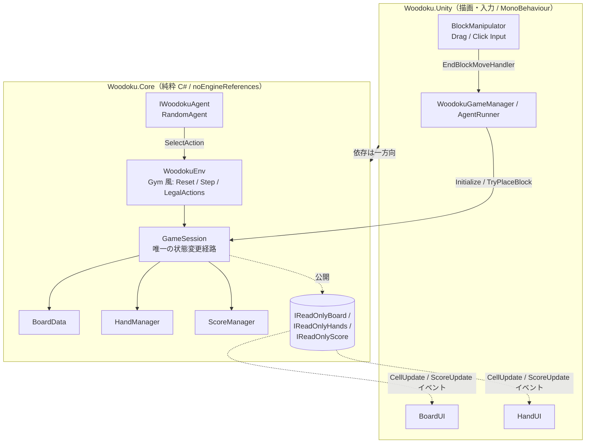

# Woodoku AI

**Woodoku（ブロックパズル × ナンプレ）を Unity / C# で実装し、ゲーム AI エージェントの実験環境として設計したプロジェクトです。**

「ゲームを作る」ことではなく、**データ・ロジック層と描画層を厳密に分離し、AI が観測・行動できる環境を設計する**ことを主題にしています。レイヤー分離をコンパイラに強制させ、純粋ロジック層（`Woodoku.Core`）だけで Unity を起動せずに学習ループを回せる構成を目指しました。


<!-- TODO: 実機プレイのスクリーンショット / GIF をここに差し込む。
     例) docs/images/gameplay.gif（人間プレイ）, docs/images/agent.gif（AgentRunner シーンのランダムエージェント自動プレイ）
     Unity プロジェクトはビジュアルが武器なので、最優先で 1 枚は載せること。 -->

> 📸 **スクリーンショット / デモ GIF を準備中**（`docs/images/` 配下に配置予定）

---

## なぜ作ったか

ゲーム AI（探索・ヒューリスティック・方策最適化）に取り組むうえで、**自分で観測・行動 API まで設計したクリーンな環境**が欲しかったのが出発点です。Woodoku は

- 状態空間が 9×9 盤面＋手札 3 枚と扱いやすく、
- ライン／3×3 ブロック消去という非自明な評価が必要で、
- 手札がランダム供給される確率的要素を持つ

ため、探索・特徴量ベース評価・先読み（expectimax）といった手法を段階的に試す題材として適しています。

「ゲーム実装」と「AI 環境」を両立させるために、最初から **ロジックと描画の分離** を設計の中心に据えました。

---

## 設計のハイライト

このプロジェクトで特に意識した設計判断です。

### 1. レイヤー分離を *規律ではなくコンパイラ* で強制

Assembly Definition を 2 つに分割し、依存方向を一方向に固定しています。

| アセンブリ | 役割 | Unity 依存 |
|---|---|---|
| `Woodoku.Core` | 盤面・手札・スコア・配置/消去ロジック、AI 環境 API | **禁止**（`noEngineReferences: true`）|
| `Woodoku.Unity` | `MonoBehaviour`・描画・入力。`Core` を参照する薄いアダプタ | あり |

`Woodoku.Core` に `using UnityEngine;` を書くと**コンパイルエラー**になります。「データと描画を分ける」という方針を、レビューでの指摘ではなくビルドが保証する状態にしました。副産物として、**Unity を起動せず .NET から `Woodoku.Core` だけを回せる**ため、将来の AI 学習ループを高速に実行できます。

### 2. 状態の公開は読み取り専用インターフェース経由

`GameSession` 内部の可変な `BoardData` / `HandManager` は `private`。外部（UI・AI）には `IReadOnlyBoard` / `IReadOnlyHands` / `IReadOnlyScore` だけを渡します。**盤面を変更できる経路は `GameSession.TryPlaceBlock` ただ一つ**に絞り、不正な状態変更をコンパイルレベルで防いでいます。

### 3. Observer パターンによる受動的な UI

盤面のセル変更は `CellUpdate` イベントとして発火し、`BoardUI` は**それに反応して該当セルだけを再描画**します。UI はロジックをポーリングせず、ロジックは UI を知りません。人間プレイ用の `WoodokuGameManager` も AI 用の `AgentRunner` も、同じイベント配線で UI が自動追従します。

### 4. 入力とロジックの分離

ドラッグ／クリック操作（`BlockManipulator` ＋ `DragBlockControlInput` / `ClickBlockControlInput`）は、配置先を `EndBlockMoveHandler` デリゲート経由で外に渡すだけ。入力デバイスの違いを吸収し、盤面ロジックからは完全に切り離しています。

### 5. Singleton を排除

`WoodokuGameManager.Instance` / `BoardUI.Instance` などの Singleton を撤廃し、依存は `Initialize(...)` での明示的な注入に統一しました（Unity でありがちな Singleton 乱用を避ける狙い）。

---

## アーキテクチャ



**配置フロー（人間プレイ）:**

```
ドラッグ／クリック
  → BlockManipulator.EndMove
  → EndBlockMoveHandler（WoodokuGameManager 経由）
  → BoardUI で画面座標 → 盤面座標へ変換
  → GameSession.TryPlaceBlock（配置 → ライン/3×3 スキャン → 消去）
  → CellUpdate / ScoreUpdate イベント
  → BoardUI / ScoreUI が自動再描画
```

---

## AI 環境としての設計

最終目標である「AI エージェントの実験環境」に向けて、観測・行動 API を Gym ライクに整備済みです。

```csharp
// Woodoku.Core — Unity 非依存。.NET 単体でも回せる
public sealed class WoodokuEnv
{
    public Observation Reset(int seed);
    public StepResult  Step(AgentAction action);   // reward = スコア差分, done = ゲームオーバー
    public IEnumerable<AgentAction> LegalActions;   // 合法手のみを列挙
}

public interface IWoodokuAgent
{
    AgentAction SelectAction(Observation obs, IEnumerable<AgentAction> legalActions);
}
```

- **観測** `Observation` … `IReadOnlyBoard`（盤面）＋ `IReadOnlyHands`（手札 3 枚）
- **行動** `AgentAction` … 「手札スロット番号 × 盤面基準位置」。`GameSession.GetLegalActions()` が合法手だけをフィルタ済みで列挙
- **報酬** スコア差分／**終端** ゲームオーバー（手詰まり）
- **可視化** `AgentRunner` シーンで、エージェントの自動プレイをコルーチンで間引きながら Unity 上に描画（人間入力は無効化して同じ UI を再利用）

ベースラインとして `RandomAgent`（合法手から一様ランダム）を実装済み。`IWoodokuAgent` を差し替えるだけで強いエージェントに置換できる構造になっています。

---

## 実装状況（正直版）

ポートフォリオとして誠実に、**できている／これからを明示**します。

| 領域 | 状態 |
|---|---|
| ゲーム本体（盤面・手札・配置・ライン/3×3 消去・スコア・ゲームオーバー・リスタート）| ✅ 完成 |
| ロジック／描画のアセンブリ分離・読み取り専用 API・Singleton 排除 | ✅ 完成 |
| AI 環境 API（`WoodokuEnv` / 観測・行動・報酬・合法手列挙）| ✅ 完成 |
| エージェント抽象 `IWoodokuAgent` ＋ `RandomAgent` ＋ 可視化 `AgentRunner` | ✅ 完成 |
| **強い**エージェント（特徴量＋線形評価、(Noisy) CEM、確率を考慮した expectimax/MCTS）| 🚧 設計済み・実装は次フェーズ |

> AI の方式は「古典的特徴量 ＋ (Noisy) CEM を C# 内で完結」で進める方針を検討済みです（[Review/review3_ai_implementation.md](Review/review3_ai_implementation.md) に比較検討と段階計画）。`Woodoku.Core` が Unity 非依存なので、ヘッドレスに大量試行する学習ループへそのまま接続できます。

詳細なタスク粒度の進捗は [ROADMAP.md](ROADMAP.md) を参照してください（`[x]` = 完了 / `[ ]` = 未着手）。

---

## 動かし方

ビルドスクリプト・テストスイートはまだありません。Unity Editor で開いて Play します。

1. **Unity 2022.3.10f1** で `Woodoku_Unity/` を開く
2. シーンを選んで Play：
   - `Assets/Scenes/MainScene.unity` … 人間がプレイ（ドラッグ／クリックでブロック配置）
   - `Assets/Scenes/AgentRunner.unity` … `RandomAgent` が自動プレイ（AI 環境のデモ）

---

## 技術スタック

- **Unity** 2022.3.10f1（2D）
- **C#** 9 / **.NET Standard** 2.1
- **Assembly Definition** によるレイヤー分割（`Woodoku.Core` / `Woodoku.Unity`）
- ブロック形状は `ScriptableObject`（`BlockData`）でオーサリングし、ロジック層は純粋型 `BlockShape` を扱う

---

## プロジェクト構成

```
Woodoku_Unity/Assets/Script/
├── Core/                     # 純粋 C#（UnityEngine 参照禁止）
│   ├── GameSession.cs        # ゲーム本体。状態変更の唯一の経路
│   ├── BoardData.cs          # 盤面 + 配置/ライン/3×3 消去ロジック
│   ├── HandManager.cs        # 手札 3 枚の供給・消費
│   ├── ScoreManager.cs       # スコア計算
│   ├── WoodokuEnv.cs         # Gym 風の AI 環境ラッパー
│   ├── ReadOnlyInterfaces.cs # IReadOnlyBoard / Hands / Score
│   ├── Agents/               # IWoodokuAgent, RandomAgent
│   └── Primitive/            # BoardPosition, BlockShape, AgentAction 等の値型
└── Unity/                    # MonoBehaviour（Core を参照）
    ├── WoodokuGameManager.cs # 人間プレイの配線
    ├── AgentRunner.cs        # エージェント自動プレイの配線
    ├── Board/                # BoardUI, Cell
    └── Hand/                 # HandUI, 入力コントローラ
```

---

## 今後

- [ ] 仮想適用（look-ahead）の足場 — 非破壊で「手を適用した後の盤面」を得る純関数
- [ ] 特徴量抽出 → 線形評価による Greedy ベースライン
- [ ] (Noisy) CEM による重み最適化（ヘッドレス大量試行）
- [ ] 既知の手札分布を chance node に取った expectimax / determinized MCTS
- [ ] 各エージェント（Random / Greedy / CEM / Expectimax）の同一環境ベンチマークと、Unity 上での思考可視化

設計の検討記録は [Review/review3_ai_implementation.md](Review/review3_ai_implementation.md) に残しています。
