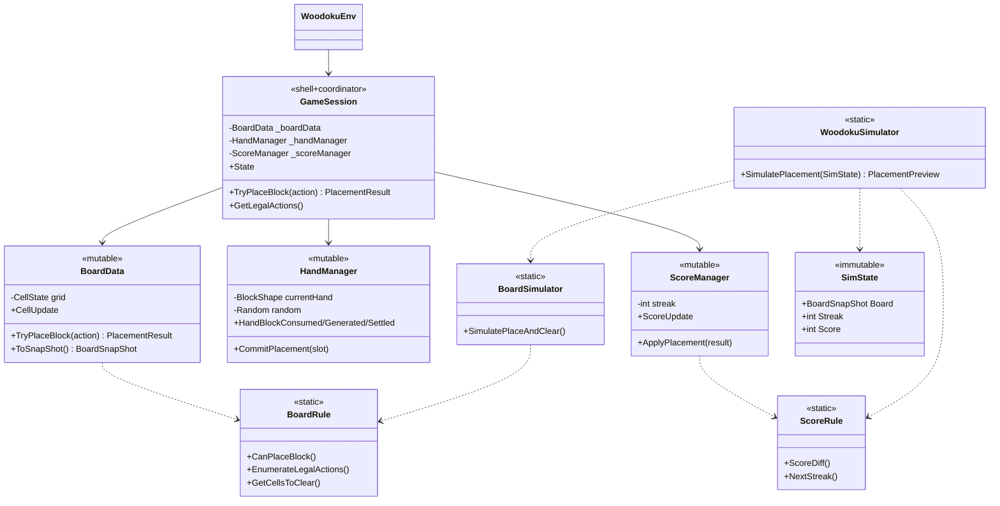
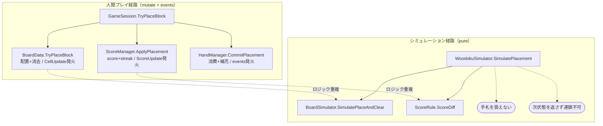
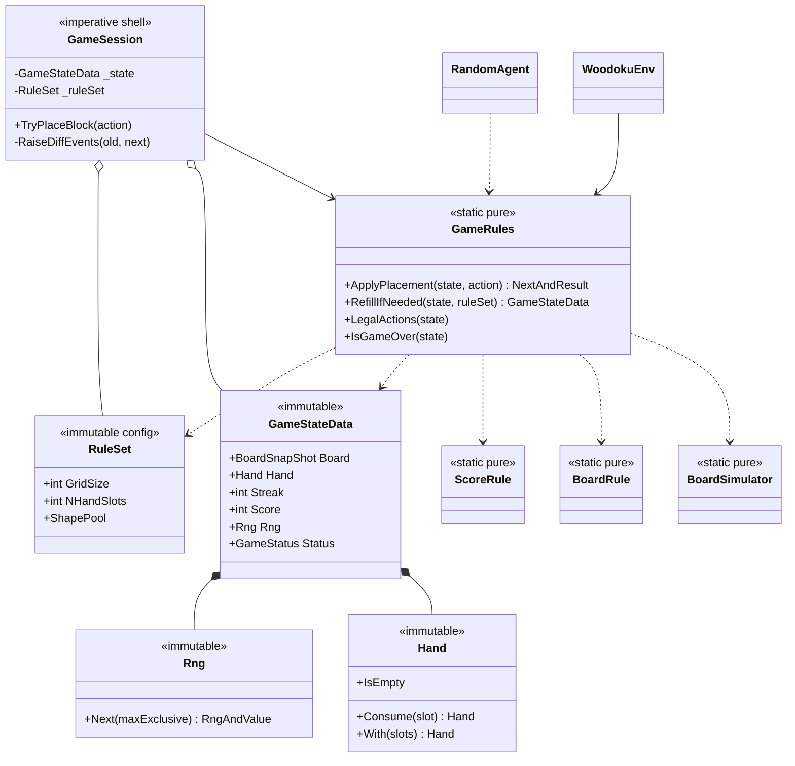
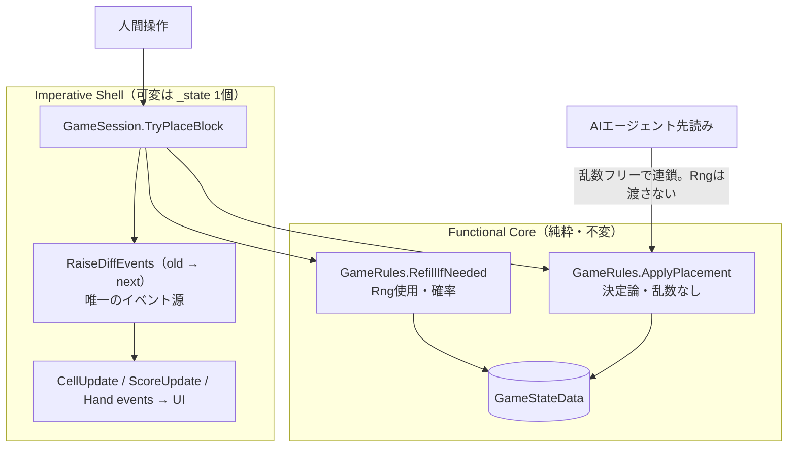
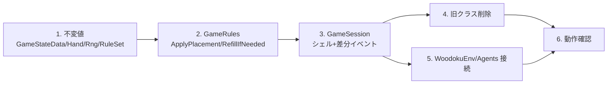

# Core 再設計：Functional Core / Imperative Shell の貫徹（2026-06-06）

ROADMAP 最終目標「AI 環境として機能させる」に向け、**人間プレイと AI シミュレーションを単一の純粋遷移関数に統合（DRY）**するための設計変更記録。
結論を先に置き、現状/変更後の設計図、ディレクトリ構成の変化、実装手順を残す。

---

## 結論

- **状態を 1 つの不変値 `GameStateData` に、遷移を 1 つの純粋関数 `GameRules.ApplyPlacement` に集約する。**
- `GameSession` は「`GameStateData` を 1 個保持し、旧状態と新状態の**差分からイベントを発火するだけ**」の薄い Imperative Shell にする。
- 可変クラス `BoardData` / `HandManager` / `ScoreManager` は**廃止**。状態は不変値へ、遷移は純粋関数へ、イベントはシェルの差分器へ吸収する。
- 乱数 `Rng` を**状態に含め**、遷移を「決定論パート（`ApplyPlacement`）」と「確率パート（`RefillIfNeeded`）」に**2 段分割**する。これにより AI は未来のピースを覗けない正しい情報境界を得る。

> 規模＝全面刷新、乱数＝状態に含めて 2 段分割、の方針で確定（2026-06-06）。

---

## 背景 — なぜ再設計するか

前回までの作業で純粋層（`BoardRule` / `ScoreRule` / `BoardSimulator` / `WoodokuSimulator` / `SimState`）を導入したが、**「状態の持ち主」が二重化**し、Core が散らかった。

1. **遷移ロジックが二重**：実プレイは `BoardData.TryPlaceBlock` + `ScoreManager.ApplyPlacement` + `HandManager.CommitPlacement`（mutate）。シミュレーションは `BoardSimulator` + `ScoreRule`（pure）。葉の計算（`BoardRule` / `ScoreRule`）は共有できたが、**「配置→消去→加点→streak→手札」という手順そのものが 2 か所に分裂**している。
2. **`SimState` が不完全**：board + streak + score だけで**手札と乱数を含まない**。連鎖シミュレーションが手札消費をまたげない。
3. **`WoodokuSimulator.SimulatePlacement` が終端**：`PlacementPreview` を返して次状態を返さず、**チェーン（先読み）の足場にならない**。
4. **状態が 2 系統**：可変トリオと不変 `SimState` が繋がっておらず、ライブ状態から `SimState` を作れない（streak は private）。

---

## 現状の設計

### クラス関係（現状）



### 遷移フローの二重化（現状の問題）



---

## 変更後の設計

### クラス関係（目標）



### 統合された遷移フロー（人間＝AI が同じ純粋関数を呼ぶ）



ポイント：**人間プレイ（`GameSession`）も AI 先読みも、同一の `GameRules.ApplyPlacement` を呼ぶ**。シェルが足すのは「mutate と差分イベント発火」だけ。

---

## 主要な型と責務

| 型 | 種別 | 責務 |
|---|---|---|
| `GameStateData` | 不変値 | 完全なゲーム状態（盤面・手札・streak・score・Rng・Status）。唯一の真実 |
| `Hand` | 不変値 | 手札スロット。`Consume` / `With` で新インスタンスを返す。`IReadOnlyHands` 実装 |
| `Rng` | 不変値 | 関数型乱数。`Next` が `(次のRng, 値)` を返す。`System.Random` を置換 |
| `RuleSet` | 不変設定 | グリッドサイズ・スロット数・利用可能ブロック集合（**公開情報**） |
| `GameRules` | 純粋静的 | 唯一の遷移。`ApplyPlacement`（決定論）/ `RefillIfNeeded`（確率）/ `LegalActions` / `IsGameOver` |
| `BoardRule` / `ScoreRule` / `BoardSimulator` | 純粋静的 | 葉の計算。`GameRules` が合成して使う（**温存**） |
| `BoardSnapShot` | 不変値 | 盤面のスナップショット（**温存**、`IReadOnlyBoard`） |
| `GameSession` | シェル | `GameStateData` を 1 個保持し、差分でイベント発火。読み取りビューは全て `_state` から導出 |

### 型シグネチャの素描（実装は学習者が記述）

```csharp
public readonly struct Rng
{
    public static Rng FromSeed(int seed);
    public (Rng next, int value) Next(int maxExclusive);   // _state は破壊せず新Rngを返す
}

public readonly struct Hand : IReadOnlyHands
{
    public Hand Consume(int slot);                          // 該当スロットを null にした新Hand
    public Hand With(IReadOnlyList<BlockShape?> slots);     // 補充後の新Hand
    public bool IsEmpty { get; }
}

public static class GameRules
{
    // 決定論・乱数なし：盤面+消去 → 加点+streak → 手札スロット消費 → Status判定（補充しない）
    public static (GameStateData next, PlacementResult result)
        ApplyPlacement(in GameStateData s, AgentAction action);

    // 確率・隠れ情報：手札が空のときだけ Rng で補充
    public static GameStateData RefillIfNeeded(in GameStateData s, RuleSet rules);

    public static IEnumerable<AgentAction> LegalActions(in GameStateData s);
    public static bool IsGameOver(in GameStateData s);
}
```

---

## 乱数と情報境界（2 段分割の理由）

| 段 | 関数 | 性質 | AI から見えるか |
|---|---|---|---|
| 1 | `ApplyPlacement` | 決定論・乱数なし | ◯ 見える（自分で連鎖できる） |
| 2 | `RefillIfNeeded` | `Rng` 使用・確率 | × `Rng` は渡さない |

- **実プレイ / Env** = `ApplyPlacement` → `RefillIfNeeded`。`Rng` が状態にあるので**再現可能**。
- **AI 先読み** = `ApplyPlacement` のみを連鎖。手札が尽きる境界は「打ち切る」か「`RuleSet.ShapePool` を使って expectimax の確率ノードに分岐」。**`Rng` を覗かない＝未来のピースを不正に知らない**。
- `RuleSet`（出現しうるピース集合）は**公開情報**なので AI に渡してよい。隠すのは `Rng`（具体的な引きの種）だけ。この区別が「環境は決定論的だが AI には確率に見える」を型で表現する。

---

## ディレクトリ構成の変化

### 現状

```
Core/
├── Agents/        IWoodokuAgent, RandomAgent
├── Board/         BoardData, BoardRule, BoardSimulator
├── Score/         ScoreManager, ScoreRule
├── Interfaces/    BoardInterfaces, ReadOnlyInterfaces
├── Primitive/     AgentAction, BlockOffset, BlockShape, BoardPosition,
│                  BoardSnapShot, CellData, EnvData, PlacementAction,
│                  PlacementPreview, PlacementResult, SimState
├── CoreExtensions.cs
├── GameSession.cs
├── HandManager.cs
├── WoodokuEnv.cs
└── WoodokuSimulator.cs
```

### 目標

```
Core/
├── Agents/        IWoodokuAgent, RandomAgent
├── Board/         BoardRule, BoardSimulator           ← BoardData 削除
├── Score/         ScoreRule                            ← ScoreManager 削除
├── Interfaces/    BoardInterfaces, HandInterfaces, ScoreInterfaces
│                  （読み取りIFとイベントIFを board と対称に分離）
├── Primitive/     ... + GameStateData(旧SimState), Hand, Rng, RuleSet
│                  ← PlacementPreview 削除、SimState を GameStateData へ昇格
├── CoreExtensions.cs
├── GameRules.cs                                        ← 新設（旧 WoodokuSimulator を昇格・吸収）
├── GameSession.cs                                       ← シェルに再実装
└── WoodokuEnv.cs
                                                         ← HandManager 削除
```

| 操作 | 対象 |
|---|---|
| **削除** | `BoardData`, `HandManager`, `ScoreManager`, `WoodokuSimulator`, `SimState`, `PlacementPreview` |
| **新設** | `GameStateData`, `Hand`, `Rng`, `RuleSet`, `GameRules`, `HandInterfaces`, `ScoreInterfaces` |
| **温存** | `BoardRule`, `ScoreRule`, `BoardSimulator`, `BoardSnapShot`, 他 Primitive 群 |
| **改名** | `GameState`(enum) → `GameStatus`、`SimState` → `GameStateData`（拡張）|
| **再実装** | `GameSession`（シェル化）, `WoodokuEnv`（GameRules 接続）|

> Unity 層（`BoardUI` / `HandUI` / `ScoreUI` / `WoodokuGameManager` / `AgentRunner`）は**イベント署名を据え置く**限り原則無改修。

---

## 実装手順（依存順）

各段でビルド可能を保ち、純粋層は Unity なしで検証できる。

1. **`GameStateData` / `Hand` / `Rng` / `RuleSet` を新設**（純粋・追加のみ。既存に影響なし）
   - `Rng`：splitmix64 / xorshift64 等。`_state` を破壊せず `(next, value)` を返す。
   - `Hand`：`BlockShape?[]` を内包し、操作のたびに clone して新インスタンス（`BoardSnapShot` と同じ不変化）。
   - `GameState` enum → `GameStatus` に改名。
2. **`GameRules` を実装**（`ApplyPlacement` / `RefillIfNeeded` / `LegalActions` / `IsGameOver`）
   - 中身は `BoardSimulator` / `BoardRule` / `ScoreRule` を合成するだけ。
   - `WoodokuSimulator` をここへ昇格・吸収。Unity 不要なのでスクラッチで一巡（配置→消去→加点→補充）を検証。
3. **`GameSession` をシェルに再実装**（`_state` + `RaiseDiffEvents` 差分器）
   - イベント分離 IF（`IHandEventPublisher` / `IScoreEventPublisher`）を board と対称に追加。読み取り IF は純粋化。
   - イベント署名は据え置き → UI 無改修。
4. **旧クラス削除**（`BoardData` / `ScoreManager` / `HandManager` / `WoodokuSimulator` / `SimState` / `PlacementPreview`、`.meta` ごと）。ビルドエラーで参照漏れを洗い出す。
5. **`WoodokuEnv` / `Agents` を `GameRules` 経由へ**。`Observation` は `GameStateData` から直接生成（`Rng` は含めない）。
6. **MainScene / AgentRunner で動作確認**。配置・消去・コンボ/streak・補充・スコア・GameOver の回帰、イベント差分の発火順・抜け、seed 固定の再現性。



---

## 移行中の不変条件・リスク

- **関数型乱数の再現性**：`System.Random` の系列は再現しないが、seed から決定論的であれば実害なし（seed 振り直し扱い）。
- **イベント差分器**：旧/新 `GameStateData` を比較して fine-grained イベントを再構成する。盤面 81 セル比較・手札スロット比較・スコア比較で機械的。発火源が 1 か所に集約されること自体が DRY 化の利得。
- **性能**：`BoardSnapShot` が毎手 81 セルを clone。現状は問題なし。深い探索で重ければ bitboard 化を別件で検討。
- **設定の所在**：`RuleSet`（ShapePool 等）は状態ではなく設定。`GameStateData` に載せず、シェルが保持し `RefillIfNeeded` に渡す。AI には公開情報として渡してよい（`Rng` は渡さない）。

---

## 関連

- ROADMAP §9（本再設計のタスク）。
- 強いエージェント本体の方針は [`review3_ai_implementation.md`](review3_ai_implementation.md)。本再設計はその「仮想適用（look-ahead）の足場」を恒久化するもの。
